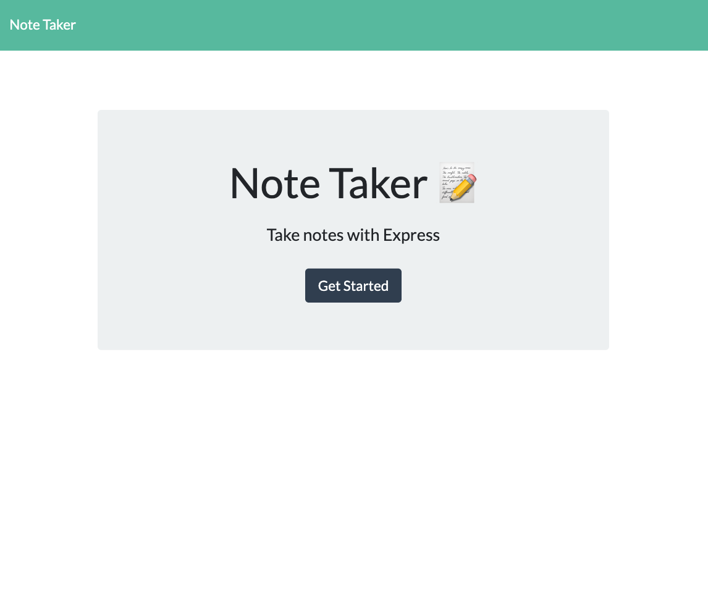
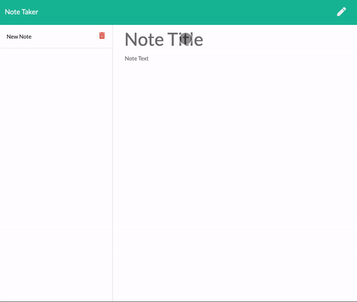

# Note Taker

This application can be used to write, save, and delete notes. This application uses on express backend and sace and retrieves note data from a JSON file.

[Link to deployed site](https://boiling-basin-36308.herokuapp.com/)

## Gettings Started

From the landing page, click get started to see the notes section.

Click in the Title/Text areas to create a new note and click the save button in the top right corner to save the note.

To view a note that was already created, just click the desired note and the title and text will populate in the original text area.

The red trash icon will delete those notes from the server.

### Built With
* Express.js
* Node.js
* JavaScript
* HTML
* CSS

#### License
MIT License Copyright (c) 2019 Taylor Bruno

Permission is hereby granted, free of charge, to any person obtaining a copy of this software and associated documentation files (the "Software"), to dealin the Software without restriction, including without limitation the rights to use, copy, modify, merge, publish, distribute, sublicense, and/or sell copies of the Software, and to permit persons to whom the Software is furnished to do so, subject to the following conditions:

The above copyright notice and this permission notice shall be included in all copies or substantial portions of the Software.

THE SOFTWARE IS PROVIDED "AS IS", WITHOUT WARRANTY OF ANY KIND, EXPRESS OR IMPLIED, INCLUDING BUT NOT LIMITED TO THE WARRANTIES OF MERCHANTABILITY, FITNESS FOR A PARTICULAR PURPOSE AND NONINFRINGEMENT. IN NO EVENT SHALL THE AUTHORS OR COPYRIGHT HOLDERS BE LIABLE FOR ANY CLAIM, DAMAGES OR OTHER LIABILITY, WHETHER IN AN ACTION OF CONTRACT, TORT OR OTHERWISE, ARISING FROM, OUT OF OR IN CONNECTION WITH THE SOFTWARE OR THE USE OR OTHER DEALINGS IN THE SOFTWARE.